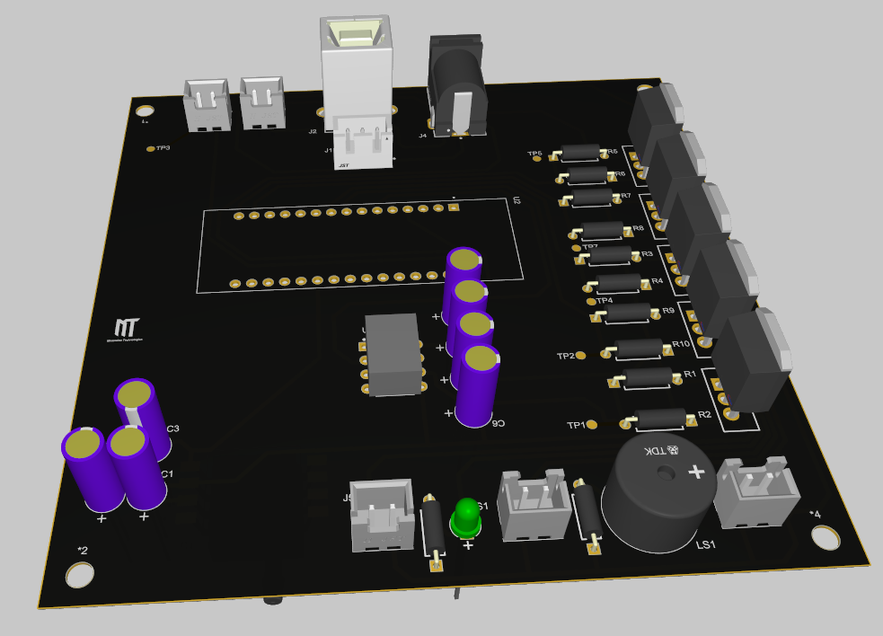

# BP Monitor POC

**Automated Blood Pressure Monitor**  
*STM32-based Oscillometric Blood Pressure Measurement System*

A complete Proof-of-Concept including custom single-layer PCB (designed for in-house fabrication), firmware, and hardware integration.

---

## ✨ Features

- **High-accuracy pressure sensing** using MP3V5050GP
- **Continuous ADC sampling** with DMA on STM32
- **Powerful actuator control** via TC4420 MOSFET driver + IRF540 power MOSFETs
- **Single-layer PCB** optimized for easy in-house fabrication
- **Complete firmware** with HAL drivers
- Ready for full **oscillometric blood pressure algorithm**

---

## 🛠️ Hardware Specifications

### Main Components
- **Microcontroller**: STM32 (STM32F4 series recommended)
- **Pressure Sensor**: MP3V5050GP (0–50 kPa)
- **Pump Driver**: TC4420 MOSFET Driver
- **Power Switches**: 5× IRF540 N-Channel MOSFETs
- **Actuators**:
  - Air Pump
  - Solenoid Valve 1 & 2
  - Buzzer + Status LED
- **Power**: 5V USB or DC input

### Key Connections
- Pressure sensor → ADC1 Channel 6 (DMA enabled)
- Pump → PA4
- Valve 1 → PA5
- Valve 2 → PA6
- Buzzer/LED → PB3

**[View Full Schematic](assets/Sch.pdf)**

---

## 📟 Firmware

**Framework**: STM32 HAL  
**Clock**: 80 MHz (PLL)  
**Peripherals Initialized**:
- ADC1 + DMA (continuous conversion)
- GPIO (output control)
- System Clock Configuration

### Current Status
- ✅ Hardware abstraction layer ready
- ✅ Pressure sampling via DMA
- ✅ Actuator control (Pump + Valves)
- 🔄 Oscillometric algorithm implementation 

---

## 🧠 Blood Pressure Algorithm

Uses the **Oscillometric Method**:

1. Inflate cuff to supra-systolic pressure (~180 mmHg)
2. Controlled linear deflation
3. Detect pressure oscillations
4. Analyze oscillation envelope
5. Determine Systolic (SBP), Diastolic (DBP), and Mean Arterial Pressure (MAP)

---

